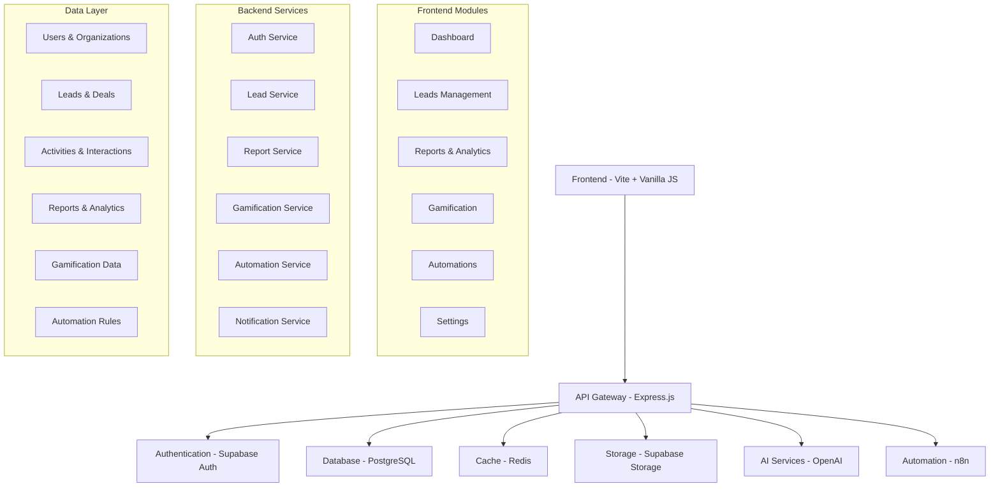

# 🚀 ALSHAM 360° PRIMA - CRM Enterprise 10/10 NASA Standard


## 📋 Índice

- [Visão Geral](#-visão-geral)
- [Características Enterprise](#-características-enterprise)
- [Arquitetura do Sistema](#-arquitetura-do-sistema)
- [Pré-requisitos](#-pré-requisitos)
- [Instalação](#-instalação)
- [Configuração](#-configuração)
- [Desenvolvimento](#-desenvolvimento)
- [Deployment](#-deployment)
- [Estrutura do Projeto](#-estrutura-do-projeto)
- [API Documentation](#-api-documentation)
- [Monitoramento](#-monitoramento)
- [Segurança](#-segurança)
- [Performance](#-performance)
- [Contribuição](#-contribuição)
- [Suporte](#-suporte)

## 🎯 Visão Geral

O **ALSHAM 360° PRIMA** é um sistema CRM enterprise de última geração, desenvolvido com padrão de qualidade NASA 10/10. Combina inteligência artificial, gamificação e automações avançadas para revolucionar a gestão de relacionamento com clientes.

### 🌟 Principais Funcionalidades

- **Dashboard Inteligente**: Analytics em tempo real com KPIs avançados
- **Gestão de Leads**: Pipeline visual com scoring automático por IA
- **Automações**: Workflows inteligentes com n8n integration
- **Gamificação**: Sistema de pontos, badges e rankings
- **Relatórios Avançados**: Insights com IA e análise preditiva
- **Multi-tenancy**: Suporte completo para múltiplas organizações
- **PWA**: Aplicação web progressiva com offline support
- **Real-time**: Atualizações em tempo real via WebSockets

## 🏢 Características Enterprise

### 🔒 Segurança Máxima
- Autenticação JWT com refresh tokens
- Criptografia end-to-end
- Rate limiting e proteção DDoS
- Auditoria completa de ações
- Compliance LGPD/GDPR

### ⚡ Performance Otimizada
- Cache Redis multi-layer
- CDN integration
- Code splitting inteligente
- Lazy loading de componentes
- Service Workers para offline

### 🔧 Escalabilidade
- Arquitetura microserviços
- Load balancing automático
- Auto-scaling no Railway
- Database sharding ready
- Cluster mode support

### 📊 Monitoramento
- Logging estruturado com Winston
- Métricas em tempo real
- Health checks automáticos
- Error tracking com Sentry
- Performance monitoring

## 🏗️ Arquitetura do Sistema



## 📋 Pré-requisitos

### Ambiente de Desenvolvimento
- **Node.js**: 18.x ou superior
- **npm**: 9.x ou superior
- **Git**: Última versão

### Serviços Externos
- **Supabase**: Projeto configurado com PostgreSQL
- **Redis**: Instância para cache (Railway fornece)
- **OpenAI**: API key para funcionalidades de IA
- **n8n**: Instância para automações (opcional)

### Ferramentas Recomendadas
- **VS Code**: Com extensões ESLint, Prettier
- **Postman**: Para testes de API
- **Redis CLI**: Para debug do cache

## 🚀 Instalação

### 1. Clone o Repositório
```bash
git clone https://github.com/alsham-team/alsham-360-prima.git
cd alsham-360-prima
```

### 2. Instale as Dependências
```bash
npm install
```

### 3. Configure o Ambiente
```bash
cp env_example_enterprise_10_10.env .env
```

### 4. Configure o Supabase
```bash
# Execute as migrations no Supabase
npm run db:migrate

# Popule dados iniciais
npm run db:seed
```

### 5. Inicie o Desenvolvimento
```bash
# Inicia o servidor de desenvolvimento
npm run dev

# Em outro terminal, inicie o backend
npm run server:dev
```

## ⚙️ Configuração

### Variáveis de Ambiente Essenciais

```env
# Supabase
SUPABASE_URL=https://your-project.supabase.co
SUPABASE_ANON_KEY=your-anon-key

# Redis
REDIS_URL=redis://localhost:6379

# OpenAI
OPENAI_API_KEY=sk-your-openai-key

# Segurança
JWT_SECRET=your-jwt-secret-min-32-chars
```

### Configuração do Supabase

1. **Crie um novo projeto** no [Supabase](https://supabase.com)
2. **Execute as migrations** disponíveis em `/database/migrations`
3. **Configure as políticas RLS** para multi-tenancy
4. **Ative a autenticação** com providers desejados

### Configuração do Redis

Para desenvolvimento local:
```bash
# macOS
brew install redis
brew services start redis

# Ubuntu
sudo apt install redis-server
sudo systemctl start redis
```

## 💻 Desenvolvimento

### Scripts Disponíveis

```bash
# Desenvolvimento
npm run dev          # Inicia Vite dev server
npm run server:dev   # Inicia Express server em modo dev
npm run dev:full     # Inicia ambos simultaneamente

# Build
npm run build        # Build para produção
npm run preview      # Preview do build
npm run analyze      # Análise do bundle

# Testes
npm run test         # Executa testes
npm run test:watch   # Testes em modo watch
npm run test:coverage # Coverage report

# Qualidade de Código
npm run lint         # ESLint
npm run lint:fix     # Fix automático
npm run format       # Prettier
npm run type-check   # TypeScript check

# Database
npm run db:migrate   # Executa migrations
npm run db:seed      # Popula dados iniciais
npm run db:reset     # Reset completo
```

### Estrutura de Desenvolvimento

```
src/
├── components/          # Componentes reutilizáveis
├── js/                 # Módulos JavaScript por página
├── lib/                # Bibliotecas e utilitários
├── pages/              # Páginas HTML
├── styles/             # Estilos CSS/SCSS
└── assets/             # Assets estáticos

server/
├── routes/             # Rotas da API
├── middleware/         # Middlewares Express
├── services/           # Lógica de negócio
├── models/             # Modelos de dados
└── utils/              # Utilitários do servidor
```

### Padrões de Código

- **ESLint**: Configuração enterprise com regras rigorosas
- **Prettier**: Formatação automática
- **Conventional Commits**: Padrão de commits
- **JSDoc**: Documentação obrigatória para funções
- **TypeScript**: Tipagem gradual sendo implementada

## 🚀 Deployment

### Railway (Recomendado)

1. **Conecte o repositório** ao Railway
2. **Configure as variáveis de ambiente**
3. **Deploy automático** a cada push

```bash
# CLI do Railway
npm install -g @railway/cli
railway login
railway link
railway up
```

### Vercel (Frontend apenas)

```bash
npm install -g vercel
vercel --prod
```

### Docker

```dockerfile
# Dockerfile incluído no projeto
docker build -t alsham-360-prima .
docker run -p 3000:3000 alsham-360-prima
```

### Configurações de Produção

```env
NODE_ENV=production
ENABLE_CLUSTER=true
ENABLE_COMPRESSION=true
FORCE_HTTPS=true
LOG_LEVEL=warn
```

## 📁 Estrutura do Projeto

```
alsham-360-prima/
├── 📁 src/                          # Código fonte frontend
│   ├── 📁 components/               # Componentes reutilizáveis
│   │   └── 📄 navigation.js         # Sistema de navegação
│   ├── 📁 js/                       # Módulos JavaScript
│   │   ├── 📄 auth.js              # Autenticação
│   │   ├── 📄 dashboard.js         # Dashboard principal
│   │   ├── 📄 leads.js             # Gestão de leads
│   │   ├── 📄 relatorios.js        # Relatórios e analytics
│   │   ├── 📄 automacoes.js        # Automações
│   │   ├── 📄 gamificacao.js       # Sistema de gamificação
│   │   └── 📄 configuracoes.js     # Configurações
│   ├── 📁 lib/                      # Bibliotecas
│   │   ├── 📄 supabase.js          # Cliente Supabase
│   │   └── 📄 redis.js             # Cliente Redis
│   ├── 📁 pages/                    # Páginas HTML
│   │   ├── 📄 dashboard.html       # Dashboard
│   │   ├── 📄 leads.html           # Gestão de leads
│   │   ├── 📄 relatorios.html      # Relatórios
│   │   ├── 📄 automacoes.html      # Automações
│   │   ├── 📄 gamificacao.html     # Gamificação
│   │   ├── 📄 configuracoes.html   # Configurações
│   │   ├── 📄 login.html           # Login
│   │   └── 📄 register.html        # Registro
│   ├── 📄 style.css                # Estilos principais
│   └── 📄 main.js                  # Script principal
├── 📁 public/                       # Assets públicos
├── 📁 server/                       # Código do servidor
├── 📁 database/                     # Migrations e seeds
├── 📁 docs/                         # Documentação
├── 📁 tests/                        # Testes automatizados
├── 📄 server.js                     # Servidor Express
├── 📄 vite.config.js               # Configuração Vite
├── 📄 package.json                 # Dependências
├── 📄 .env.example                 # Exemplo de variáveis
└── 📄 README.md                    # Este arquivo
```

## 📚 API Documentation

### Autenticação

```javascript
// Login
POST /api/auth/login
{
  "email": "user@example.com",
  "password": "password"
}

// Logout
POST /api/auth/logout
Headers: { Authorization: "Bearer <token>" }
```

### Leads

```javascript
// Listar leads
GET /api/leads?page=1&limit=20&status=new&search=termo

// Criar lead
POST /api/leads
{
  "name": "João Silva",
  "email": "joao@example.com",
  "phone": "+5511999999999",
  "source": "website"
}

// Atualizar lead
PUT /api/leads/:id
{
  "status": "qualified",
  "score": 85
}
```

### Dashboard

```javascript
// Estatísticas
GET /api/dashboard/stats

// KPIs em tempo real
GET /api/dashboard/kpis

// Gráficos
GET /api/dashboard/charts?period=30d
```

### Relatórios

```javascript
// Relatório de vendas
GET /api/reports/sales?start_date=2024-01-01&end_date=2024-01-31

// Relatório de performance
GET /api/reports/performance?user_id=123

// Exportar relatório
GET /api/reports/export?format=pdf&type=sales
```

## 📊 Monitoramento

### Health Checks

```bash
# Status do sistema
GET /health

# Métricas detalhadas
GET /metrics

# Status dos serviços
GET /status
```

### Logs

```bash
# Logs em tempo real
tail -f logs/combined.log

# Logs de erro
tail -f logs/error.log

# Logs estruturados
npm run logs:query -- --level=error --since=1h
```

### Métricas

- **Response Time**: < 200ms (95th percentile)
- **Uptime**: > 99.9%
- **Error Rate**: < 0.1%
- **Memory Usage**: < 80%
- **CPU Usage**: < 70%

## 🔒 Segurança

### Autenticação e Autorização

- **JWT Tokens**: Com refresh automático
- **Role-based Access**: Controle granular de permissões
- **Multi-factor Auth**: Suporte a 2FA
- **Session Management**: Controle de sessões ativas

### Proteções Implementadas

- **Rate Limiting**: Proteção contra ataques de força bruta
- **CORS**: Configuração restritiva de origens
- **Helmet.js**: Headers de segurança
- **Input Validation**: Sanitização de todas as entradas
- **SQL Injection**: Proteção via Supabase RLS
- **XSS Protection**: Content Security Policy

### Auditoria

```javascript
// Log de auditoria automático
{
  "user_id": "123",
  "action": "lead_created",
  "resource": "leads",
  "resource_id": "456",
  "timestamp": "2024-01-01T12:00:00Z",
  "ip_address": "192.168.1.1",
  "user_agent": "Mozilla/5.0..."
}
```

## ⚡ Performance

### Otimizações Frontend

- **Code Splitting**: Carregamento sob demanda
- **Tree Shaking**: Remoção de código não utilizado
- **Image Optimization**: Compressão automática
- **Lazy Loading**: Componentes e imagens
- **Service Worker**: Cache inteligente

### Otimizações Backend

- **Redis Cache**: Multi-layer caching
- **Database Indexing**: Índices otimizados
- **Connection Pooling**: Pool de conexões
- **Compression**: Gzip/Brotli
- **CDN**: Assets estáticos

### Métricas de Performance

```bash
# Lighthouse Score
Performance: 95+
Accessibility: 100
Best Practices: 100
SEO: 100

# Core Web Vitals
LCP: < 2.5s
FID: < 100ms
CLS: < 0.1
```

## 🤝 Contribuição

### Processo de Contribuição

1. **Fork** o repositório
2. **Crie** uma branch para sua feature (`git checkout -b feature/nova-funcionalidade`)
3. **Commit** suas mudanças (`git commit -m 'feat: adiciona nova funcionalidade'`)
4. **Push** para a branch (`git push origin feature/nova-funcionalidade`)
5. **Abra** um Pull Request

### Padrões de Commit

```bash
feat: nova funcionalidade
fix: correção de bug
docs: atualização de documentação
style: formatação de código
refactor: refatoração
test: adição de testes
chore: tarefas de manutenção
```

### Code Review

- **Testes**: Todas as mudanças devem ter testes
- **Documentação**: Funções públicas devem ter JSDoc
- **Performance**: Mudanças não devem degradar performance
- **Segurança**: Review de segurança obrigatório

## 📞 Suporte

### Canais de Suporte

- **Email**: suporte@alsham360prima.com
- **Discord**: [Servidor da Comunidade](https://discord.gg/alsham360)
- **GitHub Issues**: Para bugs e feature requests
- **Documentação**: [docs.alsham360prima.com](https://docs.alsham360prima.com)

### SLA de Suporte

- **Crítico**: 2 horas
- **Alto**: 8 horas
- **Médio**: 24 horas
- **Baixo**: 72 horas

### FAQ

**Q: Como resetar a senha de admin?**
A: Execute `npm run admin:reset-password` no servidor.

**Q: Como fazer backup dos dados?**
A: Use `npm run backup:create` ou configure backups automáticos.

**Q: Como escalar horizontalmente?**
A: Configure `ENABLE_CLUSTER=true` e ajuste `MAX_CPUS`.

## 📄 Licença

Este projeto está licenciado sob a Licença MIT - veja o arquivo [LICENSE](LICENSE) para detalhes.

## 🙏 Agradecimentos

- **Supabase**: Pela excelente plataforma de backend
- **Railway**: Pelo hosting e deployment simplificado
- **OpenAI**: Pelas capacidades de IA integradas
- **Comunidade Open Source**: Por todas as bibliotecas utilizadas

---

<div align="center">

**🚀 ALSHAM 360° PRIMA - Revolucionando o CRM Enterprise**

[](https://railway.app)
[](https://alsham360prima.railway.app)
[](https://docs.alsham360prima.com)

</div>

