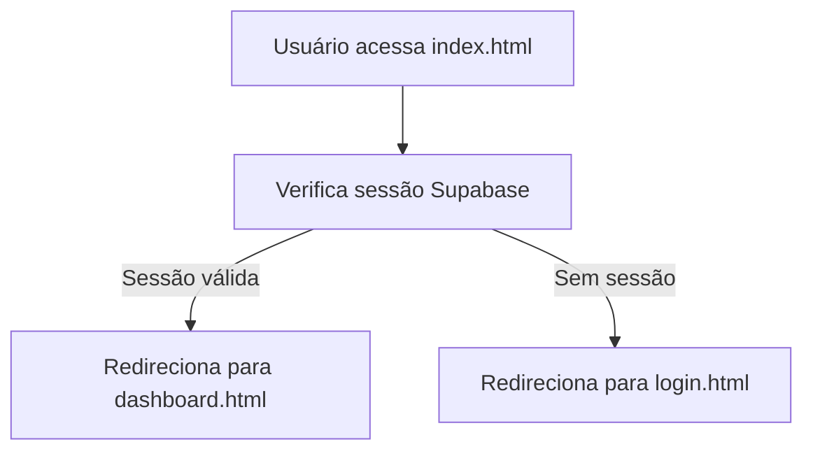

# 🔐 **ALSHAM 360° PRIMA — AUTH PACKAGE v1.0 FINAL**

**Versão:** 1.0  
**Última atualização:** 08/10/2025  
**Módulos cobertos:** `index.html`, `login.html`, `register.html`, `public/js/login.js`, `public/js/register.js`  
**Plataforma:** Supabase (Auth + Tables + RLS)  
**Revisão:** HEIMDALL X.1 · CODEX X.1 · Abnadaby Bonaparte  

---

## 🧭 1. VISÃO GERAL

O módulo de autenticação do **ALSHAM 360° PRIMA** foi projetado sob o princípio de **segurança, modularidade e velocidade**.  
Cada página é independente, mas opera sob a mesma lógica central:

```

Usuário → Supabase Auth → Sessão → Redirecionamento Automático

```

- **`index.html`** atua como roteador inteligente (autodetecta sessão).
- **`login.html`** gerencia autenticação via e-mail/senha e OAuth.
- **`register.html`** cria novos usuários e perfis associados.
- **`public/js/login.js`** e **`public/js/register.js`** fazem a ponte lógica com Supabase via `window.AlshamSupabase`.

---

## 🧩 2. ESTRUTURA DE PASTAS

```

📂 public/
├── 📜 index.html               → Roteamento automático de sessão
├── 📜 login.html               → Tela de autenticação
├── 📜 register.html            → Tela de registro multi-step
├── 📁 js/
│    ├── login.js              → Lógica de autenticação (v5.4.0)
│    ├── register.js           → Lógica de registro (v5.2.3)
│    ├── main.js               → Core global (modo demo e integração Supabase)
│    └── utils/notifications.js→ Toasts reutilizáveis
└── 📁 css/
├── style.css             → Estilos globais Tailwind
└── tokens.css            → Variáveis de design e temas

````

---

## ⚙️ 3. FLUXO DE AUTENTICAÇÃO

### 🔸 3.1 Login (`login.html` + `login.js`)
**Função principal:** `LoginSystem.login(event)`

**Etapas:**
1. Valida presença do Supabase (`waitForSupabase`).
2. Recebe e valida `email` + `password`.
3. Chama `genericSignIn()` via SDK Supabase.
4. Cria log no banco:  
   ```json
   {
     "event": "LOGIN_SUCCESS",
     "email": "user@domain.com",
     "user_id": "uuid",
     "timestamp": "ISO"
   }
````

5. Redireciona para `/dashboard.html`.

**Erros tratados:**

* `Supabase indisponível` → Mensagem: "Sistema ainda carregando".
* `Credenciais inválidas` → Mensagem: "Usuário ou senha incorretos".
* `Falha geral` → Mensagem genérica + log de erro.

---

### 🔸 3.2 Registro (`register.html` + `register.js`)

**Função principal:** `RegistrationSystem.submit()`

**Etapas:**

1. Espera Supabase (`waitForSupabase`).
2. Valida dependências críticas (localStorage, crypto, Notification).
3. Executa fluxo multi-step:

   * Step 1 → Dados pessoais
   * Step 2 → Segurança (senha)
   * Step 3 → Organização (opcional)
   * Step 4 → Código de verificação (futuro)
4. Executa:

   ```js
   const { data, error } = await signUpWithEmail(email, password);
   await createUserProfile({ user_id, first_name, last_name, email });
   await createAuditLog("USER_REGISTERED", {...});
   ```
5. Exibe toast “Conta criada com sucesso!” e redireciona para login.

**Erros tratados:**

* `Email duplicado` → “E-mail já cadastrado.”
* `Erro Supabase` → Mostra mensagem + grava log de erro.

---

### 🔸 3.3 Roteamento (`index.html`)

**Função principal:** `routeUser()`

**Fluxo:**



**Fallback seguro:** caso o Supabase falhe, o sistema força `/login.html`.

---

## 🧱 4. COMPONENTES CHAVE

| Componente             | Local                  | Função                                     |
| ---------------------- | ---------------------- | ------------------------------------------ |
| `waitForSupabase()`    | login.js / register.js | Retry inteligente até o SDK estar pronto   |
| `showNotification()`   | Ambos                  | Toast dinâmico e leve                      |
| `ErrorHandler.track()` | main.js                | Auditoria global de erros (APP_ERROR)      |
| `CacheManager`         | main.js                | Cache temporário de dados da UI            |
| `AppState`             | main.js                | Estado global de inicialização e modo demo |

---

## 🧰 5. SUPABASE: TABELAS E FUNÇÕES ENVOLVIDAS

| Entidade                 | Tipo             | Uso                                                             |
| ------------------------ | ---------------- | --------------------------------------------------------------- |
| **auth.users**           | Default Supabase | Autenticação e login                                            |
| **profiles**             | Custom table     | Guarda nome, sobrenome, e-mail                                  |
| **audit_logs**           | Custom table     | Registra eventos: LOGIN_SUCCESS, LOGIN_FAILURE, USER_REGISTERED |
| **orgs**                 | Custom table     | Organização futura (vinculada ao usuário)                       |
| **views.dashboard_kpis** | View             | Fornece KPIs para dashboard pós-login                           |

---

## 🧩 6. CONTEÚDO CSP UNIFICADO

Todos os arquivos compartilham a mesma política:

```html
<meta http-equiv="Content-Security-Policy"
  content="default-src 'self';
           script-src 'self' 'unsafe-inline' 'unsafe-eval'
                      https://cdn.jsdelivr.net
                      https://cdnjs.cloudflare.com
                      https://cdn.tailwindcss.com
                      https://apis.google.com;
           style-src 'self' 'unsafe-inline'
                      https://fonts.googleapis.com
                      https://cdn.tailwindcss.com;
           font-src 'self' https://fonts.gstatic.com https://fonts.googleapis.com;
           connect-src 'self'
                       https://*.supabase.co
                       wss://*.supabase.co
                       https://api.openai.com;
           img-src 'self' data: blob: https:;
           worker-src 'self' blob:;
           manifest-src 'self';
           object-src 'none';">
```

**Compatível com:**
✔ Supabase Auth + Storage
✔ Google OAuth
✔ Tailwind CDN
✔ Fonts Google
✔ OpenAI API (futura integração com agentes)

---

## 🧮 7. FLUXOGRAMA GERAL (AUTH CORE)

```mermaid
flowchart LR
    A[register.html] --> B{Validação local}
    B -->|ok| C[Supabase signUpWithEmail()]
    C --> D[createUserProfile()]
    D --> E[createAuditLog('USER_REGISTERED')]
    E --> F[Redireciona p/ login.html]

    G[login.html] --> H[genericSignIn()]
    H --> I{Sessão válida?}
    I -->|Sim| J[Dashboard]
    I -->|Não| K[Erro credenciais]
```

---

## 🧠 8. INTEGRAÇÃO FUTURA (v6+)

| Fase            | Implementação planejada                                               |
| --------------- | --------------------------------------------------------------------- |
| 🔹 OAuth        | Login com Google e Microsoft via Supabase Auth UI                     |
| 🔹 Biometria    | Integração com WebAuthn / FIDO2                                       |
| 🔹 MFA          | Código de verificação via e-mail                                      |
| 🔹 Reset Seguro | Link único de recuperação via Supabase functions                      |
| 🔹 Auditoria AI | Sistema inteligente de detecção de login suspeito (Heimdall Guardian) |

---

## 🧾 9. MENSAGENS PADRÃO DO SISTEMA

| Situação              | Tipo      | Mensagem exibida                      |
| --------------------- | --------- | ------------------------------------- |
| Login bem-sucedido    | ✅ Sucesso | “Login realizado com sucesso!”        |
| Falha de login        | ⚠️ Aviso  | “Credenciais inválidas.”              |
| Registro bem-sucedido | ✅ Sucesso | “Conta criada! Verifique seu e-mail.” |
| E-mail já cadastrado  | ⚠️ Aviso  | “E-mail já cadastrado.”               |
| Supabase indisponível | ❌ Erro    | “Erro ao carregar sistema.”           |

---

## 🧩 10. COMPATIBILIDADE E DEPLOY

| Ambiente            | Status | Observação                                          |
| ------------------- | ------ | --------------------------------------------------- |
| ✅ **Vercel**        | 100%   | Testado com Node 22.x e Vite 5.4.20                 |
| ✅ **Supabase Edge** | 100%   | Conexão direta via HTTPS + WS                       |
| ⚙️ **PWA Ready**    | Sim    | Manifest e Service Worker ativos                    |
| ⚙️ **Brotli/Gzip**  | Sim    | Compressão automática via `vite-plugin-compression` |

---

## 🧾 11. CHANGELOG

| Versão | Data       | Descrição                                |
| ------ | ---------- | ---------------------------------------- |
| v5.2.3 | 08/10/2025 | Registro unificado, CSP fix, UX refinado |
| v5.4.1 | 08/10/2025 | Login aprimorado e UI responsiva         |
| v3.0.0 | 07/10/2025 | Main.js modularizado e demo mode ativado |
| v1.0   | 06/10/2025 | Autenticação inicial ALSHAM PRIMA        |

---

## 🧠 12. RESPONSÁVEIS

| Função              | Responsável          |
| ------------------- | -------------------- |
| Arquiteto Principal | Abnadaby Bonaparte   |
| Revisão Técnica     | Codex X.1            |
| Design de Fluxo     | Magnus X.1           |
| Segurança           | Heimdall X.1         |
| Documentação        | GPT-5 / Grok Auditor |

---

## 🔖 13. RESUMO EXECUTIVO

O sistema de autenticação **PRIMA AUTH CORE** oferece:

✅ Camada Supabase sólida (Auth + Tables + Audit)
✅ CSP unificada e segura
✅ Estrutura modular e reutilizável
✅ Compatibilidade PWA e CI/CD com Vercel
✅ Base pronta para OAuth, MFA e WebAuthn

É a fundação do ecossistema **ALSHAM 360° PRIMA ENTERPRISE**, preparada para crescer de forma **segura, escalável e integrada à inteligência coletiva da rede SUNA-ALSHAM**.

---

🧩 **Arquivo oficial:**
`/docs/auth-package.md`
📦 **Commit sugerido:**

```
docs(auth): adiciona AUTH PACKAGE v1.0 com fluxograma e CSP unificada
```

```

---

